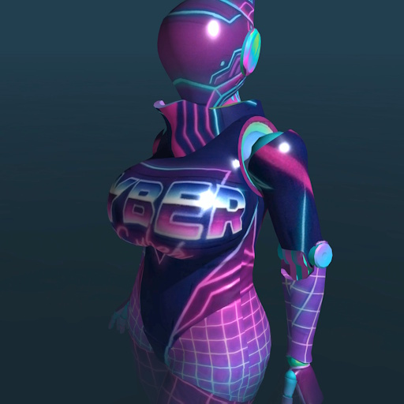

# 🌴 Haydee: Synthwave Outfit 🌴



🔗 **[Get it on Steam Workshop!](https://steamcommunity.com/sharedfiles/filedetails/?id=3670764079)**

Bring the vibrant pulse of the 80s into the void. This mod gives **Haydee** a high-contrast, retro-futuristic makeover inspired by the classic Synthwave aesthetic. 

> **About the Game:** This is a custom outfit mod for **[Haydee](https://store.steampowered.com/app/530890/Haydee/)**, a hardcore, old-school metroidvania mixed with third-person shooter and platformer mechanics, known for its challenging puzzles, lack of auto-saves, and its iconic half-human, half-robot protagonist.

The industrial metal is replaced with neon gradients, sunset horizons, and the iconic silhouette of digital palm trees.

## ✨ Features
* **Full Texture Overhaul:** A custom UV map skin featuring a purple, pink, and cyan "Retrowave" palette.
* **The Signature Look:** The suit’s high-energy neon patterns create a striking contrast with Haydee’s iconic, featureless white helmet.
* **Sleek Aesthetic:** Designed to look great under any lighting conditions in-game.

## � Source Code & Folder Structure
This repository contains the loose, unpacked files of the mod.

```text
📦 haydee-synthwave-outfit
 ┣ 📜 LICENSE              # Unlicense (Public Domain)
 ┣ 📜 README.md            # This documentation
 ┣ 🖼️ preview.jpg          # Steam Workshop preview image
 ┗ 📂 Outfits              # Main game directory structure
   ┣ 📜 Synthwave.outfit   # Outfit configuration file
   ┗ 📂 Synthwave          # Mod assets folder
     ┣ 📜 Suit.mtl         # Material definition
     ┗ 🖼️ Suit_D.dds       # Diffuse texture map (The actual skin)
```

## 🛠 Manual Installation (From GitHub)
To install the mod manually from these source files:
1. Download or clone this repository to your PC.
2. Locate your Haydee installation directory (usually `...\Steam\steamapps\common\Haydee\`).
3. Copy the `Outfits` folder from this repository and drop it into the root `Haydee` directory.
   *(This will place the `Synthwave.outfit` file and `Synthwave` folder directly into your game's `Outfits` folder).*
4. Launch the game.
5. Go to **Settings -> Outfit**.
6. Select **Synthwave** from the list.

> [!IMPORTANT]
> If the mod does not appear in the list, ensure the `.outfit` file is present in the correct path. If you just copy textures without an `.outfit` file, Haydee will not recognize it as a new suit.

## ⚙️ Modding & Development Info
Feel free to use these files as a reference or template for creating your own outfits for Haydee.

### Local Testing (Loose Files)
For testing your mod locally in Haydee, **you do not need to pack it into a `.pack` archive**. 
In fact, during development, it is much easier to use "loose files" (regular folders) to quickly make edits and instantly see the results.

1. Place your files directly into your `...\Haydee\Outfits\` folder in the correct structure.
2. The game perfectly reads unpacked files from the `Outfits` directory.

### Publishing to Steam Workshop
When you are ready to share your outfit, you can upload it directly to the Steam Workshop using the game's built-in tools.

#### 1. Prepare a Thumbnail
- Create a preview image for your mod (`preview.png` or `preview.jpg`).
- The image should be square (e.g., 512x512 or 256x256).
- Place this image in your mod folder.

#### 2. Launch Edith Editor
The upload tools are located in the game's editor, not the game itself:
- Go to your Haydee root installation folder.
- Run `Edith.exe`.
- In the top menu bar, select **Tool -> Workshop Uploader**.

#### 3. Fill in the Uploader Data
In the uploader window, fill out the following fields:
- **Mod Content:** At the very top of the upload form, there is a text field with a **Browse** button beneath it. You will use this to build the list of files to upload:
  1. Click **Browse** and add your mod's main folder (for this mod, select `Outfits/Synthwave`).
  2. Click **Browse** again and add your `.outfit` definition file (for this mod, select `Outfits/Synthwave.outfit`).
  *(This ensures you include the full set of files required for the mod to work).*
- **Title:** The name of your outfit (this will be displayed on Steam).
- **Description:** A short description of the mod (what it is, special features, etc.).
- **Visibility:** It is recommended to set this to **Private** first to verify how everything looks on the Steam page, and change it to **Public** later.
- **Preview Image:** Select the thumbnail image you prepared in step 1.

Once filled out, click **Upload**. If everything goes well, the status at the bottom will show **"Success"**.

## 📄 License
This project is open-source and released into the **Public Domain** under the [Unlicense](https://unlicense.org/) (`LICENSE`).